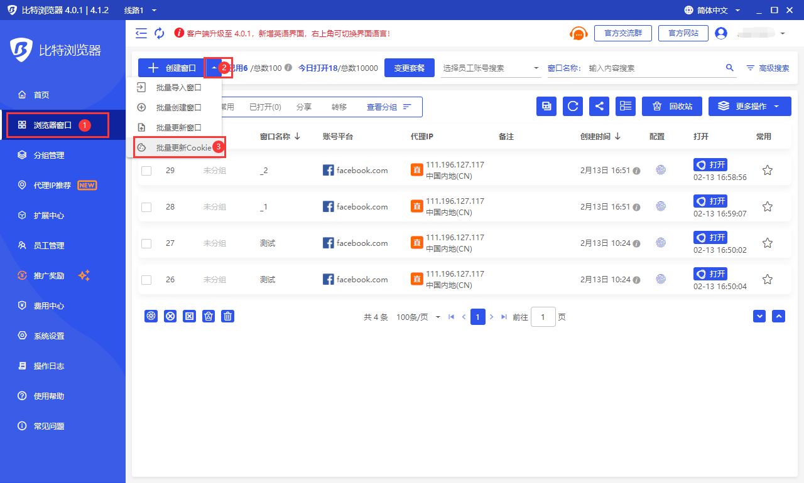
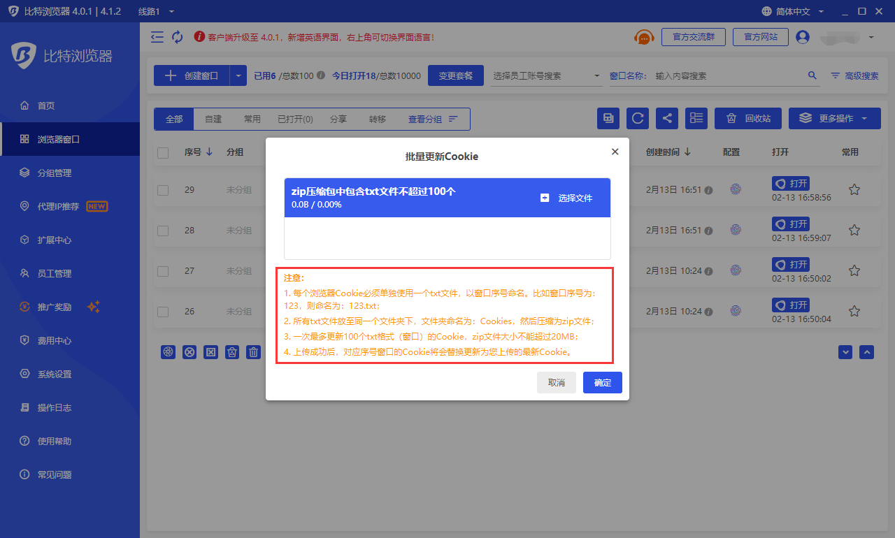

# 批量导出Cookie/批量更新Cookie

### 批量导出Cookie

打开客户端 -> 进入左侧菜单项“浏览器窗口” -> 点击“更多操作”按钮 -> 点击菜单项“批量导出Cookie”。目前支持导出选中的浏览器窗口Cookie、导出指定序号范围窗口的Cookie、导出指定分组窗口的Cookie。

<figure><figcaption></figcaption></figure>

### 批量更新Cookie

打开客户端 -> 点击左侧菜单“浏览器窗口” -> 点击“创建窗口”按钮右侧的“V”图标 -> 点击“批量更新Cookie”导入需要更新的文件夹zip文件，选择“确定”按钮更新成功。

<mark style="color:red;">注意：</mark>

&#x20;<mark style="color:red;">1. 每个浏览器Cookie必须单独使用一个txt文件，以窗口序号命名。比如窗口序号为：123，则命名为：123.txt；</mark>

<mark style="color:red;">2. 所有txt文件放至同一个文件夹下，文件夹命名为：Cookies，然后压缩为zip文件；</mark>

<mark style="color:red;">3. 一次最多更新100个txt格式（窗口）的Cookie.zip文件大小不能超过20MB；</mark>

<mark style="color:red;">4. 上传成功后，对应序号窗口的Cookie将会替换更新为您上传的最新Cookie。</mark>

<figure><figcaption></figcaption></figure>

<figure><figcaption></figcaption></figure>
