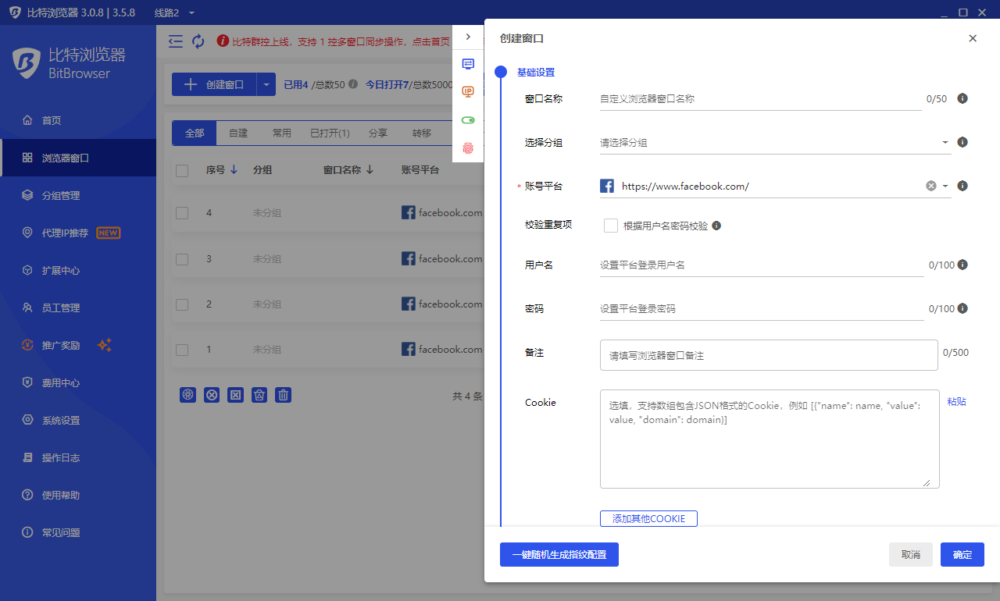

# 新建浏览器窗口

* 打开客户端 -> 点击左侧菜单“浏览器窗口” -> 点击“创建窗口”按钮

.png>)

* 以下为创建窗口页面，各个功能参数，大家根据自己实际情况及工作需求填写：

<figure><figcaption></figcaption></figure>

1. 窗口名称：为新建的浏览器环境命名，方便以后的备忘、日常管理操作。
2. 分组：为该浏览器窗口选择分组，可以在浏览器窗口界面中的“管理分组”功能，增加、删除、修改分组。
3. 账号平台：这里为必选项，选择指定的平台网址，以后打开该浏览器窗口，将自动打开该平台地址，并将下面的用户名、密码自动填充进入登录页面，免输入，提高工作效率；若是列表中没有想要的平台网址，可以选择最下面项“其他平台”，然后在下方弹出的输入框中输入想打开的网址，下面的用户名、密码同样会自动填充进入自定义网址的登录框。
4. 校验重复项：勾选校验重复项，账号平台、用户名、密码都不为空时才进行校验，会与自己过去所有的数据进行对比，前述3者完全相同时才判定为重复项且不会创建该窗口。
5. Cookie：设置后，会自动将该cookie信息导入到浏览器窗口，下次打开浏览器窗口时会以导入cookie的状态来打开
6. 打开指定网址：通过设置打开指定网址，每次打开该浏览器窗口时，将自动打开您设定的网址，支持多个网址！
7. 代理方式：使用自定义代理则需要自行准备代理IP，然后填入。
8. 代理类型：使用本地IP或者本机代理软件的IP，请选择直连模式；使用代理IP，支持http、https、socks5、ssh、等形式代理IP，具体设置方法，可以参考[代理IP设置](../dailiip/)。

#### 浏览器窗口指纹设置：

.png>)

* 以上为浏览器指纹设置，我们会不断更新指纹功能。请根据自己实际工作环境、综合情况，进行各项指纹的相应设置。需要了解各个指纹功能，请参考[浏览器指纹支持](../../fingerprint/)。
* 点击“一键随机生成指纹配置”按钮，则会全自动为您随机设置所有的指纹信息！
