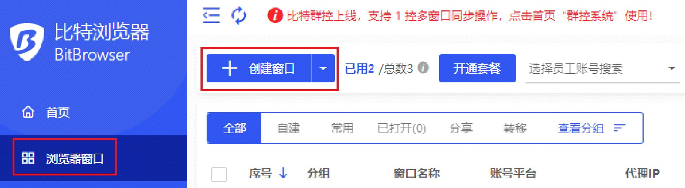

# 如何设置BrightData代理

第1步、注册并登录比特浏览器。比特指纹浏览器官网：[https://www.bitbrowser.cn/](https://www.bitbrowser.cn/)

第2步、点击浏览器窗口界面中的“创建窗口”按钮。

<figure><figcaption></figcaption></figure>

第3步、选择代理类型。BrightData支持HTTP/HTTP/SOCKS5协议。

<figure><figcaption></figcaption></figure>

第4步、配置代理。在BrightData中生成代理信息，并粘贴到比特浏览器的代理设置中，然后进行代理 检测，检测代理IP的连通性！

BrightData界面：

注册Brightdata账户：[ https://brightdata.grsm.io/bitbrowser](https://brightdata.grsm.io/bitbrowser)&#x20;

进入控制版面

<figure><figcaption></figcaption></figure>

<figure><figcaption></figcaption></figure>

<figure><figcaption></figcaption></figure>

<figure><figcaption></figcaption></figure>

<figure><figcaption></figcaption></figure>

比特指纹浏览器界面：

<figure><figcaption></figcaption></figure>

第5步、如果需要更改其他设置，更改过后，点击“确定”按钮完成设置。

<figure><figcaption></figcaption></figure>

第6步、您可以在“浏览器窗口”界面，看到刚刚配置的窗口，点击“打开”按钮开始使用！

<figure><figcaption></figcaption></figure>
