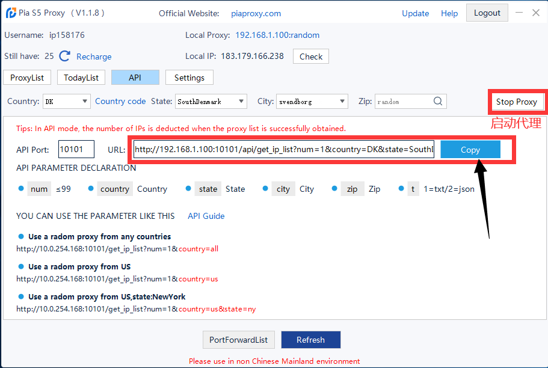

# 如何设置Pia S5 代理



方法一：手动设置socks5代理

1.打开Pia S5客户端，顶部的信息代表含义为：① 你的用户名 ② 本机IP及端口 ③ 剩余IP数量 ④ 代理信息

<figure><figcaption></figcaption></figure>

2.过滤国家和城市，点击“启动代理”获取目标国家的IP列表。

<figure><figcaption></figcaption></figure>

3.右键点击一个IP，点击“Forward Port To Proxy”，选择一个端口。

<figure><figcaption></figcaption></figure>

4.点击“PortForwardList”查看详细代理参数。

<figure><figcaption></figcaption></figure>

5.打开比特浏览器，选择浏览器窗口，点击“创建窗口”。

<figure><figcaption></figcaption></figure>

6.进行“代理设置”，代理类型选择“socks5”，输入"代理主机"和“代理端口”，输入完成后点击“代理检测”，检测成功后，点击“确定”，这样就设置完毕啦！

<figure><figcaption></figcaption></figure>

#### 方法二：通过API获取代理

1.进入Pia s5，点击API选项卡，选择指定的“国家”、“国家编号”、“城市”、“邮编”，点击启动代理。

<figure><figcaption></figcaption></figure>

2.点击“启动代理”后会获取到一个URL，点击“Copy”按钮复制。

<figure><figcaption></figcaption></figure>

3.打开比特浏览器，创建窗口，“代理设置”选择“使用代理平台API提取链接提取”，“服务商”选择“Pia S5”，代理协议选择“socks5”，在“提取链接”处粘贴刚才Copy的URL，粘贴完成后点击“测试提取”，会显示获取到的“代理信息”，点击“确定”代理设置成功。

<figure><figcaption></figcaption></figure>
