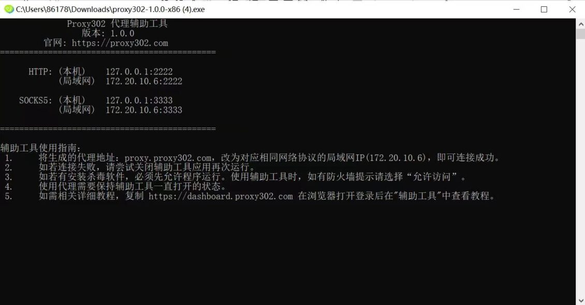

# 如何设置Proxy302代理

设置Proxy302代理（[https://www.proxy302.com/](https://www.proxy302.com/)）需要科学上网后使用，若没有科学上网，请参考**非海外环境下-连接教程**；若已科学上网，直接参考**海外环境下-连接教程**。

## 非海外环境下-连接教程 

1.登录Proxy302客户端，打开【连接工具】-【辅助工具】，点击下载。

<figure><figcaption></figcaption></figure>

2.运行该应用。

<figure><figcaption></figcaption></figure>

3.等待加载，加载成功后如下图所示，辅助工具启动成功，按最小化使辅助工具在后台运行即可。

<figure><figcaption></figcaption></figure>

4.选择所需代理类型，生成代理。

<figure><figcaption></figcaption></figure>

5.复制Proxy302代理【地址：端口：用户名：密码】

<figure><figcaption></figcaption></figure>

6.登录比特浏览器客户端，打开浏览器窗口，点击创建窗口。

<figure><figcaption></figcaption></figure>

7.填写弹框中的代理设置，点击“代理主机”输入框，粘贴代理【地址:端口:用户名:密码】。

<figure><figcaption></figcaption></figure>

8.点开辅助工具，复制局域网地址，将局域网地址填入代理主机中。

<figure><figcaption></figcaption></figure>

9.点击“代理检测”按钮，检查代理是否连接成功。

<figure><figcaption></figcaption></figure>

10.点击“确定”按钮，成功修改代理。

<figure><figcaption></figcaption></figure>

11.点击对应序号的“打开”按钮。

<figure><figcaption></figcaption></figure>

12.导入账号后，点击打开，即可打开各个不同环境的浏览器。

<figure><figcaption></figcaption></figure>

***

## 海外环境下-连接教程 

1.登录Proxy302客户端，生成代理。

<figure><figcaption></figcaption></figure>

2.复制Proxy302代理【地址:端口:用户名:密码】。

<figure><figcaption></figcaption></figure>

3.登录比特浏览器客户端，打开浏览器窗口，点击创建窗口。

<figure><figcaption></figcaption></figure>

4.填写弹框中的代理设置，点击“代理主机”输入框，粘贴代理【地址:端口:用户名:密码】。

<figure><figcaption></figcaption></figure>

5.点击“代理检测”按钮，检查代理是否连接成功。

<figure><figcaption></figcaption></figure>

6.点击“确定”按钮，成功修改代理。

<figure><figcaption></figcaption></figure>

7.点击对应序号的“打开”按钮。

<figure><figcaption></figcaption></figure>

8.导入账号后，点击打开，即可打开各个不同环境的浏览器。

<figure><figcaption></figcaption></figure>
