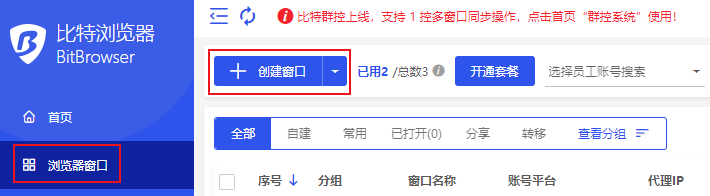
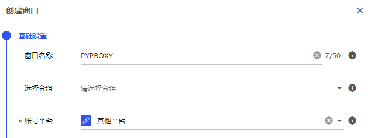
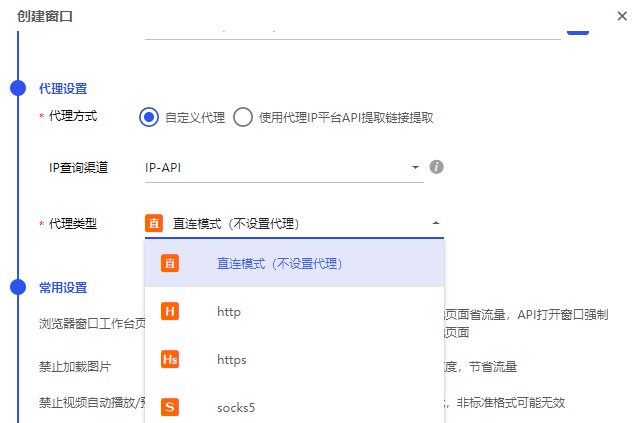
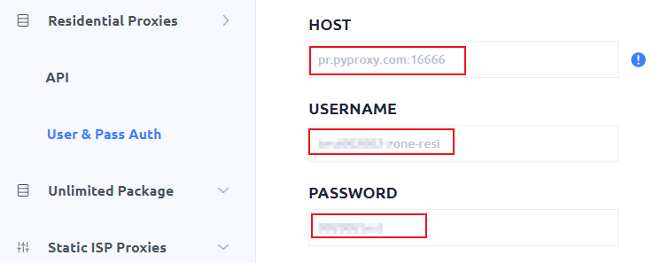
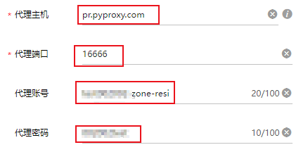
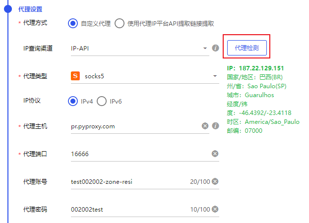
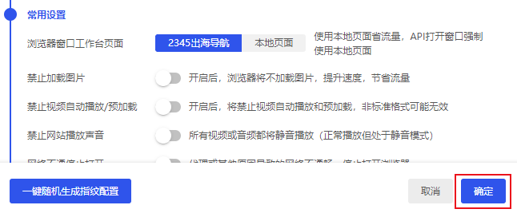
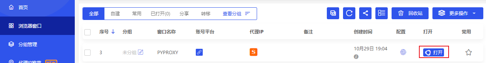

# 如何设置PYPROXY S5代理

第一步、注册并登录比特浏览器。PYPROXY S5官网：[https://www.pyproxy.com/](https://www.pyproxy.com/)

第二步、点击浏览器窗口界面中的创建窗口按钮。

<figure><figcaption></figcaption></figure>

第三步、配置窗口的基础设置。

<figure><figcaption></figcaption></figure>

第四步、选择代理类型。PYPROXY支持HTTP/HTTPS/SOCKS5协议。

<figure><figcaption></figcaption></figure>

第五步、配置代理。在PYPROXY中生成代理信息，并粘贴到比特浏览器的代理设置中。

PYPROXY：

<figure><figcaption></figcaption></figure>

比特浏览器：

<figure><figcaption></figcaption></figure>

第六步、点击代理检测按钮，检查当前代理是否可用。

<figure><figcaption></figcaption></figure>

第七步、如果需要的话，更改其他设置，点击确定按钮完成设置。

<figure><figcaption></figcaption></figure>

第八步、您可以在浏览器窗口页面看到刚刚配置的窗口，点击打开按钮开始使用。

<figure><figcaption></figcaption></figure>
