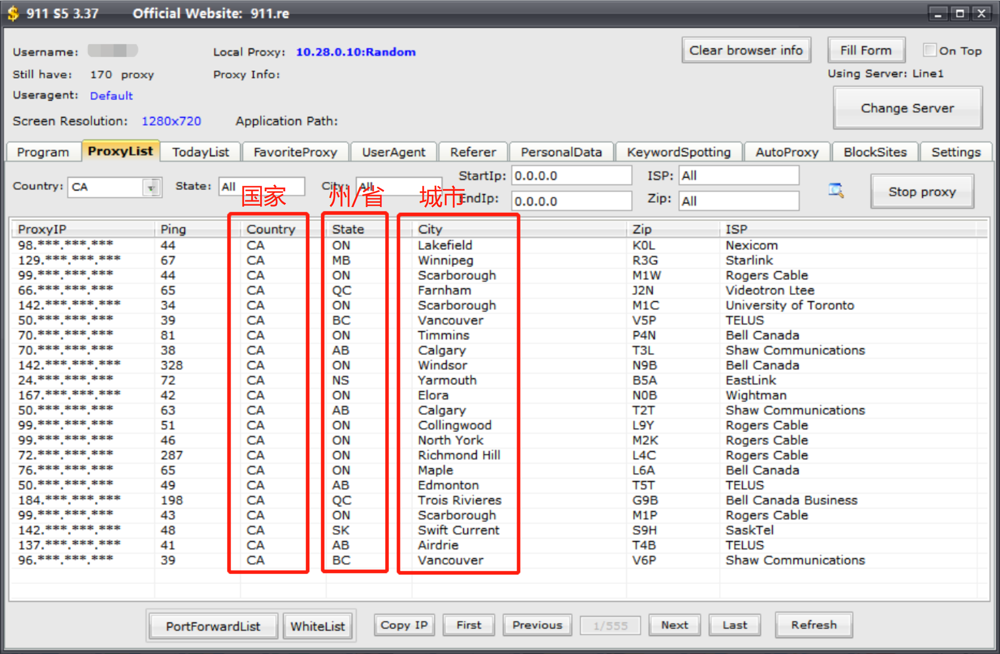

# 设置911S5代理IP

911S5 是一家海外IP代理服务供应商，提供数十万的动态住宅IP，有独立的客户端。

目前，指纹浏览器完美的接入了911S5代理IP，具体设置方法如下：

（注：若想让多个窗口，同时共用同一个911S5的代理IP，详细可以参考 [如何让多个窗口使用相同的911s5的IP](../../question/question2/4.md)）

### 911S5客户端设置

1. 下载及购买911s5代理：http://911.re/
2. 安装好以后，启动911s5客户端，登录911S5账号。
3. 在AutoProxy页面，勾选“Use API”（如果已勾选则忽略）

.png>)

* 在Settings页面，修改Port Forward为【4440-4539】，点击“Save”；去掉limit used s5 IP 的勾选，点击“Save”。如下图所示：

.png>)

### （1）创建浏览器窗口——设置911S5代理

**方法一：通过socks5代理方法**

打开911S5客户端，将想要代理的IP，转发到电脑上的指定端口，然后指纹浏览器窗口的代理类型使用“socks5”，代理主机填写本地IP“127.0.0.1”，代理端口填写转发的端口。详细操作过程可以参考： [如何让多个窗口使用相同的911s5的IP](../../question/question2/4.md)

**方法二：通过911S5接口方法**

1. 客户端 -> 点击左侧菜单项“浏览器窗口” -> 点击“创建窗口”按钮
2. 代理方式，选择“自定义代理”
3. 代理类型，选择：911s5

.png>)

1. IP地址，可以从911S5客户端的“ProxyList”寻找合适国家地区的IP，填写以后：\
   **若是未勾选“只代理当前IP”情况下：**会使用该IP进行代理，若是不填写则系统会从您设定的国家/地区、州/省、城市中随机选择。该IP可以使用情况下，系统会优先使用该IP；若IP不通畅，则系统会从下方设置的位置信息自动寻找可用的IP。\
   **若是勾选“只代理当前IP”情况下：**打开窗口时只使用这个IP代理，若这个IP失效也不会自动更换可用IP代理，就算不填写IP情况下，也不会自动寻找可用IP进行代理。
2. 国家/地区、州/省、城市，请填写代码形式，具体的代码可以通过911S5客户端内“Proxylist”进行查询。如下图所示：

### （2）导入浏览器窗口——设置911S5代理

1. 客户端 -> 点击左侧菜单项“浏览器窗口” -> 点击“创建窗口”按钮旁边的“V”图标 -> 点击“批量导入窗口”
2. 下载“导入账号模板”excel文件
3. 打开模板文件，如下图所示：

.png>)

1. “代理类型”列：请填写：911s5，如①所示。
2. “国家/地区”、“州/省”、“城市”列：请填写相关代码，如②③④所示，具体的代码可以通过911S5客户端内“Proxylist”进行查询或导入窗口模板附带的“国家代码表”中查询。如果②③④不填写，则系统会随机选择一个地区的代理IP使用；若是填写，则会在您填写的地区随机选择一个代理IP使用！
3. 填写好以后，保存文档，并导入！
