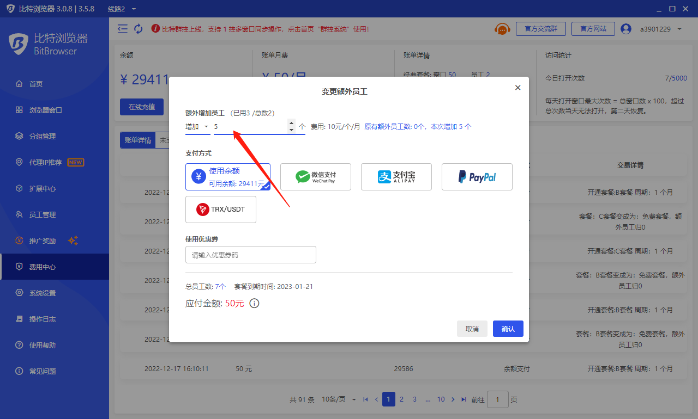

# 开通套餐、变更套餐、续费套餐

* 软件支持免费试用，目前可以永久免费使用10个窗口！
* 若想享有更多窗口及功能权限，请开通套餐、变更套餐！
* 开通套餐方法：客户端->点击左侧菜单项“浏览器窗口”->点击右上角按钮“开通套餐”，或者客户端->点击左侧菜单项“费用中心”->点击“开通套餐”按钮。
* “变更套餐”按钮、“续费套餐”功能在费用中心中！
* 如果套餐中附带的员工数量不够，需要更多的员工，请在“费用中心”页面的“变更员工”输入框中输入具体想增加的个数！

.png>)

.png>)

<figure><figcaption></figcaption></figure>

<figure><figcaption></figcaption></figure>
