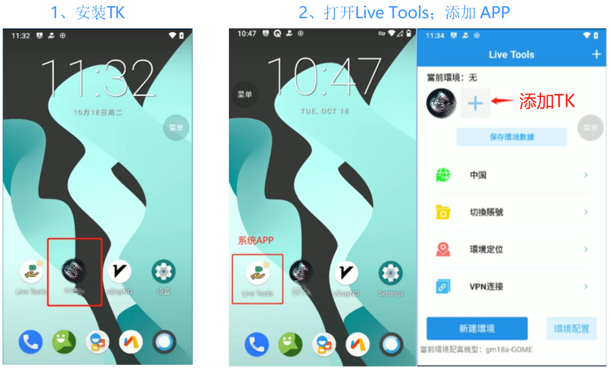

# 如何让多个窗口使用相同的911s5的IP？

* 911s5设置如下：

1. 确认911s5的端口范围与指纹浏览器启动说明一致（4440-4539）
2. 确认911s5软件已勾选“支持API调用”！
3. 在ProxyList中，筛选国家/地区，选择IP。
4. 在IP上点击右键，选则Forward Port To Proxy。
5. 选择一个具体的端口！

* 指纹浏览器设置如下：

1. 选择代理方式为“自定义代理”，选择代理类型为“socks5”
2. 代理主机填写911s5所在电脑的本地IP，大部分为：127.0.0.1
3. 代理端口填写为上面刚设置的
4. 代理账号、代理密码，留空不做填写
5. 检查代理并保存设置

