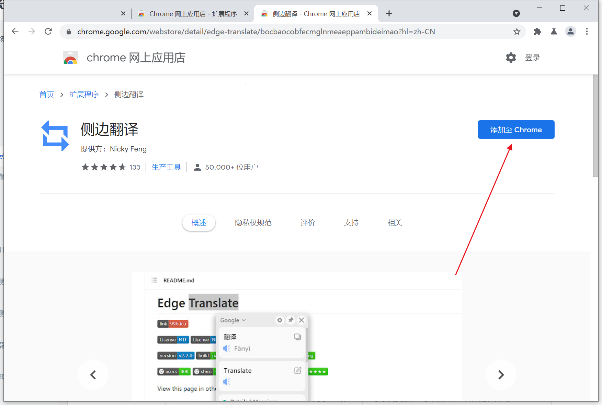

# 如何安装翻译插件或其他浏览器插件

首先打开浏览器窗口后，在网址栏输入谷歌插件应用商店网址：https://chrome.google.com/webstore/category/extensions?hl=zh-CN，并进入，如下图所示：

.png>)

* 在红框1处输入想要寻找的插件名称，输入后按回车键即可搜索。
* 这里安装一款网页翻译翻译插件做举例，“edge translate”（中文名：侧边翻译）
*   打开该插件在谷歌应用商店的网址：https://chrome.google.com/webstore/detail/edge-translate/bocbaocobfecmglnmeaeppambideimao?hl=zh-CN，如下图所示，点击“添加至Chrome”按钮，然后在弹出对话框中，点击“添加扩展程序”按钮！

    （注：个别用户若是习惯使用谷歌原生的翻译插件“Google翻译”，可以在：https://chrome.google.com/webstore/detail/google-translate/aapbdbdomjkkjkaonfhkkikfgjllcleb?hl=zh-CN 进行下载安装）

.png>)

插件安装完成以后，如下图所示，点击箭头1处图标，弹出菜单，点击箭头2所指菜单项，即可弹出插件管理界面。

.png>)

如下图所示，在插件管理界面，或者在浏览器空白处使用鼠标右键点击弹出菜单中“翻译此页”，均可对网页进行翻译！

.png>)  (1).png>)

插件可以进行一些个性化设置，比如：默认使用谷歌翻译还是使用网易有道翻译、翻译语言等，可以根据需求自行设置，如需对插件进行设置，如下图所示，点击箭头指向的插件后边的“三个点”图标，在弹出菜单中可以进行插件的设置和管理！

.png>)

其他插件的操作步骤，和该过程基本大同小异，请自行研究！
