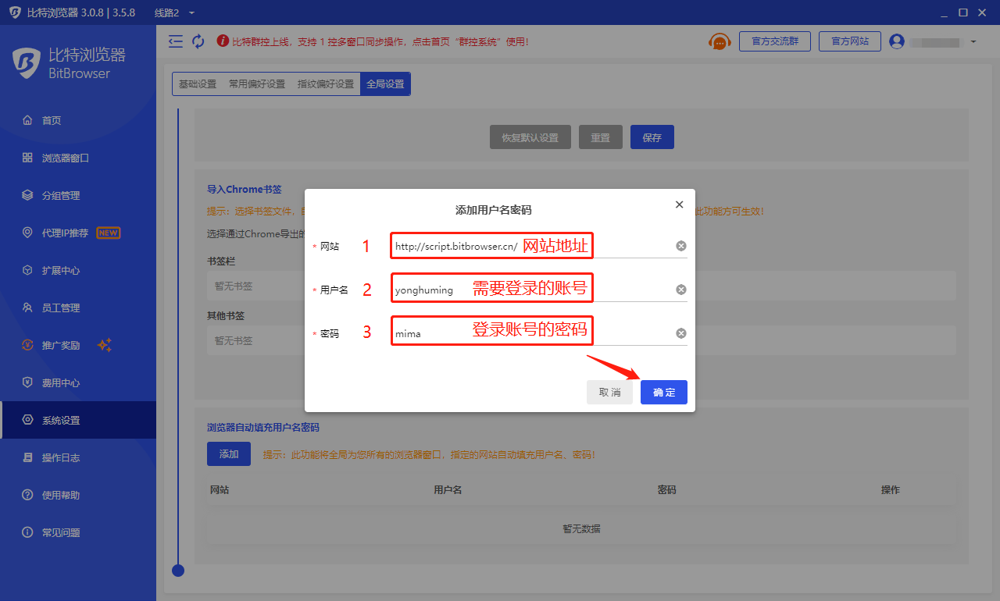
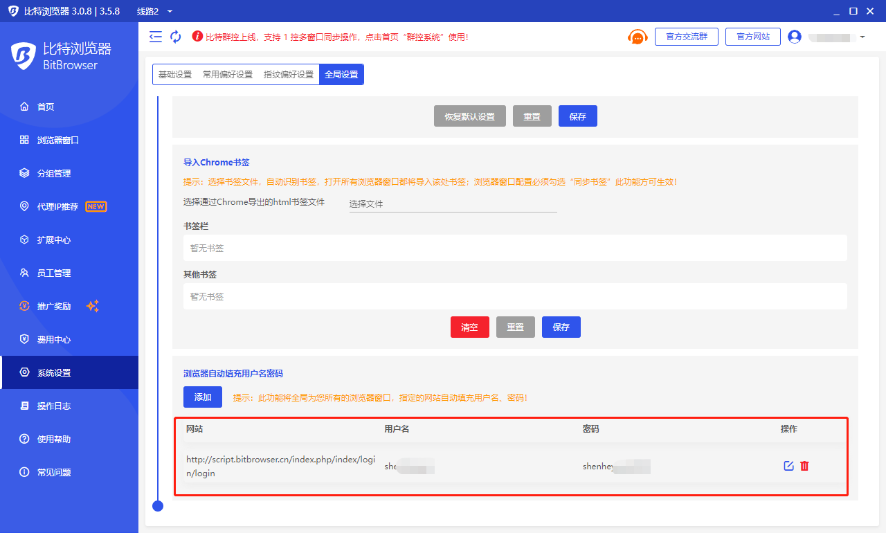
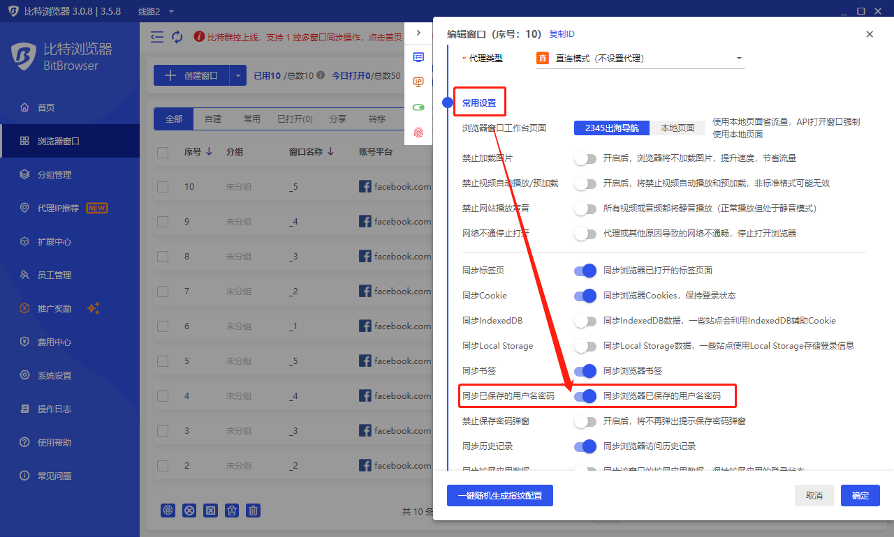
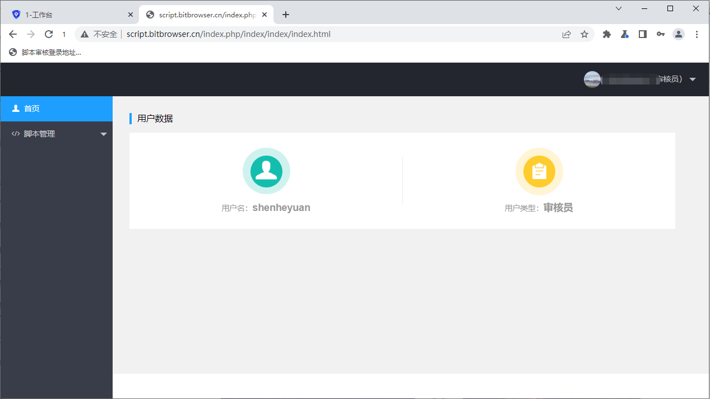

# 如何让每个浏览器窗口自动填充用户名密码

1.首先，打开“系统设置”，然后下拉到全局设置“浏览器自动填充用户名密码”。点击“添加按钮”。

<figure><figcaption></figcaption></figure>

2.进入添加界面后，输入您需要登录的“网站地址”、“用户名”、“密码”，点击“确定”保存。

<figure><figcaption></figcaption></figure>

3.保存完成后，会显示您保存的“网站”、“用户名”、“密码”、还可以选择“铅笔”及时的修改信息以及删除等操作。

<figure><figcaption></figcaption></figure>

4.进入比特“浏览器窗口”页面，点击配置进入到“常用设置”。

<figure><figcaption></figcaption></figure>

5.在这里开启“同步已保存的用户名密码”功能，点击确定保存。

<figure><figcaption></figcaption></figure>

6.保存后打开浏览器窗口，进入我们需要进入的网站，选择已保存的“用户名密码”选择登陆。

<figure><figcaption></figcaption></figure>

7.这样就可以直接登陆进来啦！

<figure><figcaption></figcaption></figure>
