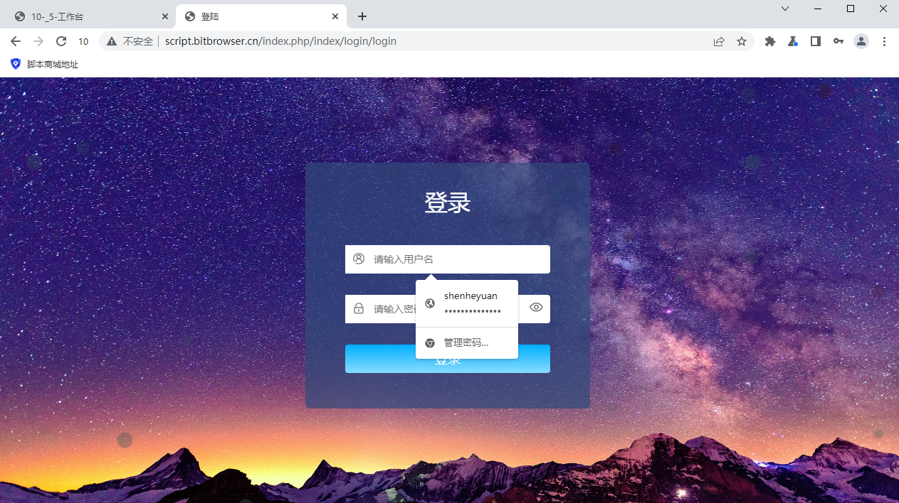

# 如何让每个浏览器窗口自动填充用户名密码

1.首先，打开“系统设置”，然后下拉到全局设置“浏览器自动填充用户名密码”，点击“添加”按钮。

<figure><figcaption></figcaption></figure>

2.进入添加界面后，输入您需要登录的“网站地址”、需要填充的“用户名”和“密码”，点击“确定”保存。

<figure><figcaption></figcaption></figure>

3.保存完成后，会显示您保存的“网站”、“用户名”、“密码”、还可以进行修改信息及删除等操作。

<figure><figcaption></figcaption></figure>

4.进入“浏览器窗口”，点击配置进入到“常用设置”。

<figure><figcaption></figcaption></figure>

5.在这里开启“同步已保存的用户名密码”功能，点击“确定”保存。

<figure><figcaption></figcaption></figure>

6.保存后，打开浏览器窗口，进入我们设定的网站，用户名、密码就会自动填充到相应的输入框啦！

<figure><figcaption></figcaption></figure>
