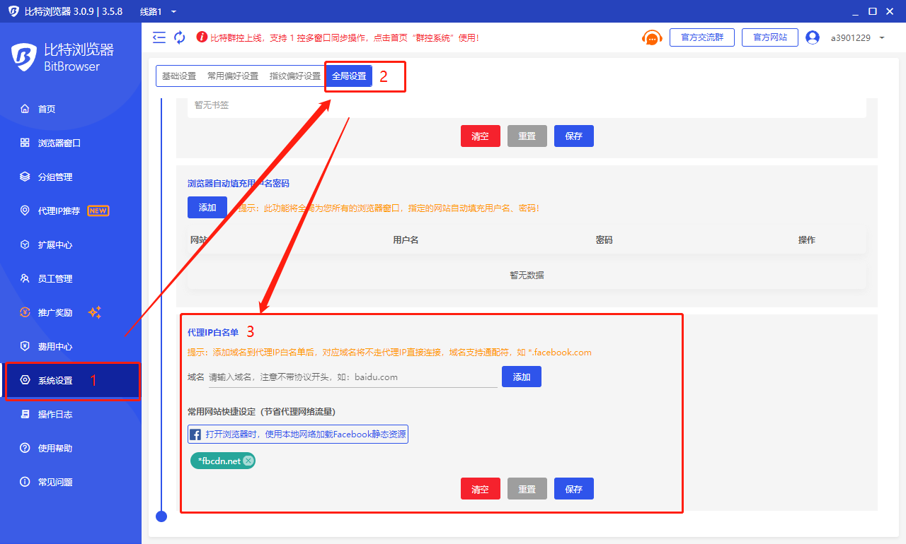

# 如何使用代理IP白名单功能节省代理流量

1.首先，打开“系统设置”，然后下拉到全局设置“代理IP白名单”。

<figure><figcaption></figcaption></figure>

2.然后输入需要添加白名单的域名，如“\*baidu.com”，点击“添加”按钮，下面显示已添加的域名地址，点击“保存”按钮。

<figure><figcaption></figcaption></figure>

<figure><figcaption></figcaption></figure>
