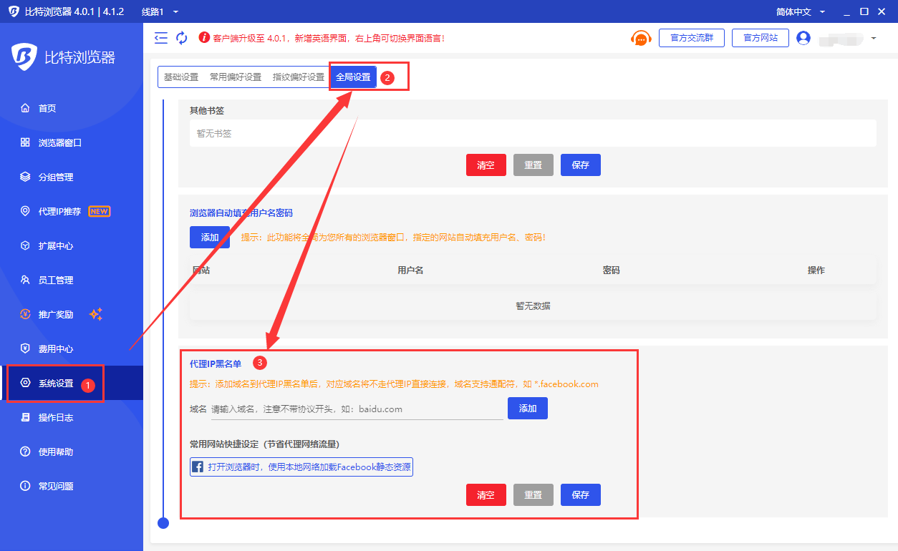
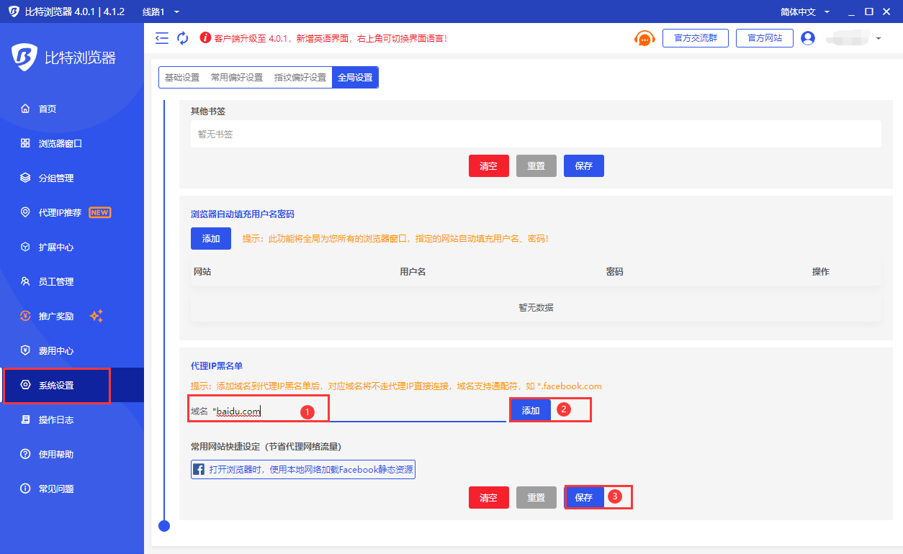

# 如何使用代理IP黑名单功能节省代理流量

1.首先，打开“系统设置”，然后下拉到全局设置“代理IP黑名单”。

<figure><figcaption></figcaption></figure>

2.然后输入需要添加黑名单的域名，如“\*baidu.com”，点击“添加”按钮，下面显示已添加的域名地址，点击“保存”按钮。

<figure><figcaption></figcaption></figure>

3.这样一来，任何浏览器窗口，打开我们添加到代理IP黑名单中的网站都将不走代理IP网络，而是走本地网络，节省代理流量的使用！

<figure><figcaption></figcaption></figure>

<figure><figcaption></figcaption></figure>

**注：**下方的“常用网站快捷设定（节省代理网络流量）”，内置了一些常用网站不走代理网络的快捷设定，如有需求请自行快捷设定！
