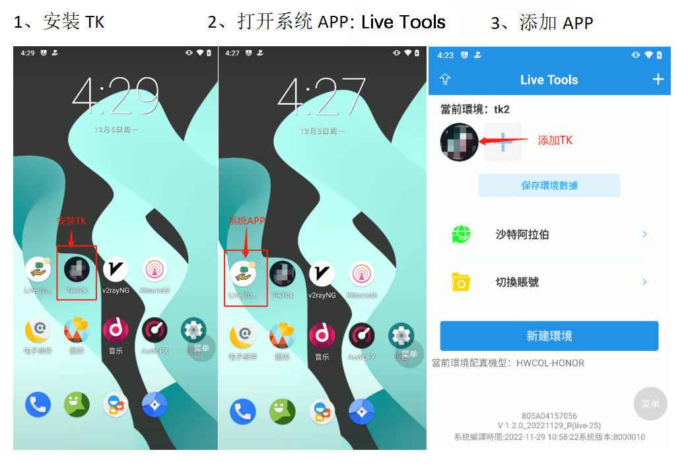
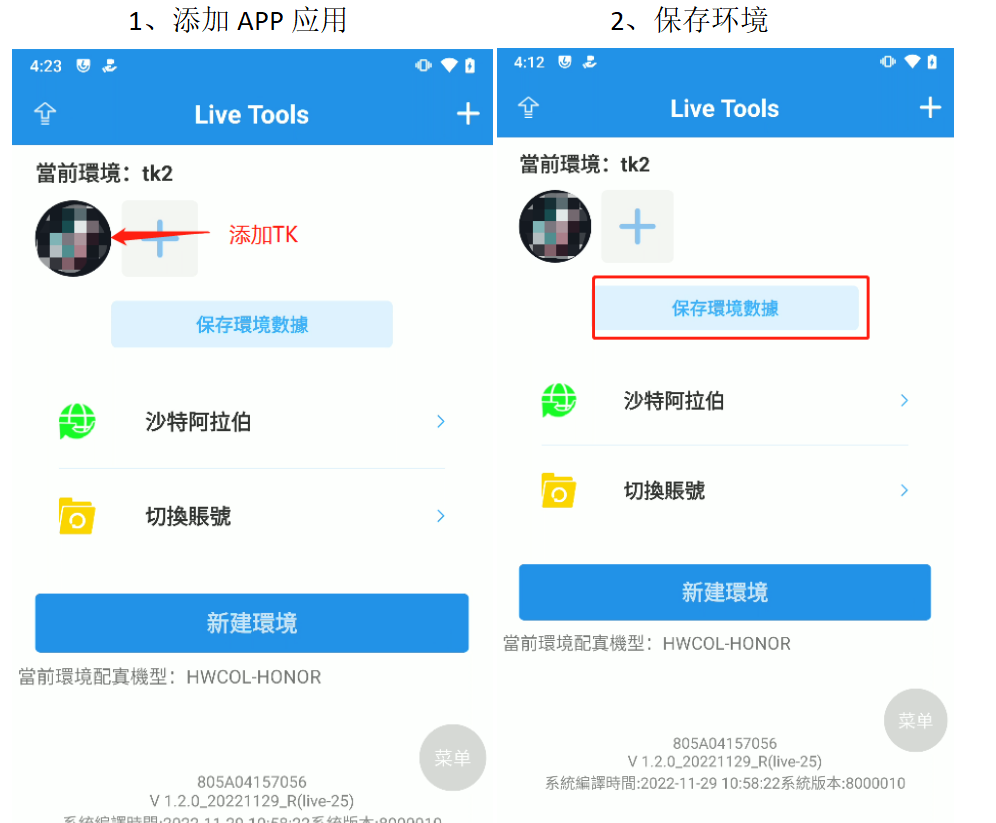

# 操作指南（图文教程）

## 新建环境

第一步：指纹手机开机，连接本地网络（WiFi）

第二步：安装所需 APP（以TK为例）；打开系统 APP（Live Tools）；添加TK APP

**注：**

**1.新建环境时，建议关闭网络节点以提升创建速度。**

**2.进行保存环境（备份环境）时，仅保存已添加的APP及APP缓存数据。**

**3. 一个环境下尽量控制只添加1-2个APP , 否则备份的文件太大，导致还原环境出错。**

**4. 备份环境后，添加的APP在手机中不能卸载，卸载会导致还原环境报错。**

<figure><figcaption></figcaption></figure>

第三步：创建环境

添加APP 到环境下，选择对应国家，点击新建环境，等待新建完成，打开添加的APP，登陆APP 账号， 保存环境数据；若切换其他环境，再切换回来，账号还是默认登陆好的。

**注：**

**1. 每个环境下，添加进来的APP 都为独立手机环境中的APP。**

**2.每次新建环境，手机各项参数都随机生成，无需自己操作。**

<figure><figcaption></figcaption></figure>

第四步：修改手机语言、时区

1、修改语言

<figure><figcaption></figcaption></figure>

2、修改时区

<figure><figcaption></figcaption></figure>

第五步：点击“保存环境数据”，将当前环境保存到手机内部存储空间。（便于以后切换环境时，进行环境还原）

## 保存/还原/管理环境

**注：**

**1.建议先关闭网络节点后，再操作，以提升执行速度。**

**2.点击保存环境，默认把备份环境文件保存在手机存储空间下的backup 文件夹下。**

<figure><figcaption></figcaption></figure>

<figure><figcaption></figcaption></figure>

## 无人直播操作讲解

第一步：设置网络（支持多种网络节点），以v2rayNG 为示范。

<figure><figcaption></figcaption></figure>

第二步：注册、登录APP，以TK为例。

<figure><figcaption></figcaption></figure>

第三步：设置直播视频素材

1、将视频做成尺寸（9:16）格式后；再将视频顺时针旋转 90 度后，尺寸调成 16:9。

<figure><figcaption></figcaption></figure>

2、将视频放置手机存储 video 文件夹下，如果没有video 文件夹，请自行创建一个名字为 video 文件夹。

<figure><figcaption></figcaption></figure>

3、点击，选择直播视频素材。

<figure><figcaption></figcaption></figure>

4、设置无播（无人直播），再点“+”号开无人直播。

<figure><figcaption></figcaption></figure>

5、设置直播（实时直播），点“+”号开直播。

<figure><figcaption></figcaption></figure>

6、原音：直播视频素材原有声音；配音：直播视频素材原音消失，输入外界音频声音（口播）

**注：直播过程中，可一键切换原音和配音！**

<figure><figcaption></figcaption></figure>

<mark style="color:red;">操作过程讲解完毕，有疑问请咨询销售顾问或售后技术支持！！！</mark>
