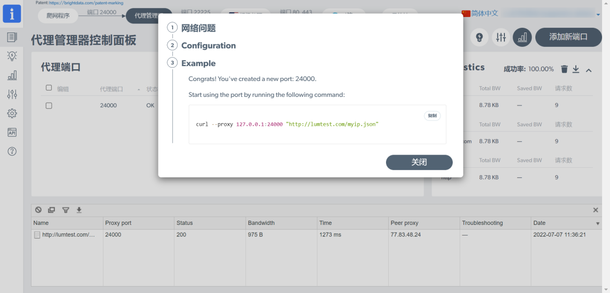

# 操作指南（图文教程）

## 新建环境

第一步：指纹手机开机，连接本地网络（WiFi），手机插入U盘（用于存储环境信息）

第二步：安装所需 APP（以TK为例）；打开系统 APP（Live Tools）；添加TK APP

**注：1.新建环境时，建议关闭网络节点以提升创建速度。2.进行保存环境（备份环境）时，仅保存已添加的APP及APP数据！**

<figure><figcaption></figcaption></figure>

第三步：创建环境（选择国家、环境配置、环境定位、新建环境）

**注：点击“环境配置”，可以配置环境的各项指纹参数，以使得每个环境都是一台独一无二的手机！根据自身业务情况灵活配置即可，不做任何配置则会自动随机各项环境参数。**

<figure><figcaption></figcaption></figure>

第四步：修改手机语言、时区

1、修改语言

<figure><figcaption></figcaption></figure>

2、修改时区

<figure><figcaption></figcaption></figure>

第五步：点击“保存环境数据”，将当前环境保存到U盘中。（便于以后切换环境时，进行环境还原）

## 保存/还原/管理环境

**注：建议先关闭网络节点后，再操作，以提升执行速度！**

<figure><figcaption></figcaption></figure>

<figure><figcaption></figcaption></figure>

## 无人直播操作讲解

第一步：设置网络（支持多种网络节点），以v2rayNG 为示范。

<figure><figcaption></figcaption></figure>

第二步：注册、登录APP，以TK为例。

<figure><figcaption></figcaption></figure>

第三步：设置直播视频素材

1、将视频做成尺寸（9:16）格式后；再将视频顺时针旋转 90 度后，尺寸调成 16:9。

<figure><figcaption></figcaption></figure>

2、将视频放置 U 盘 video 文件夹

<figure><figcaption></figcaption></figure>

3、点击，选择直播视频素材。

<figure><figcaption></figcaption></figure>

4、设置无播（无人直播），再点“+”号开无人直播。

<figure><figcaption></figcaption></figure>

5、设置直播（实时直播），点“+”号开直播。

<figure><figcaption></figcaption></figure>

6、原音：直播视频素材原有声音；配音：直播视频素材原音消失，输入外界音频声音（口播）

**注：直播过程中，可一键切换原音和配音！**

<figure><figcaption></figcaption></figure>

<mark style="color:red;">操作过程讲解完毕，有疑问请咨询销售顾问或售后技术支持！！！</mark>
