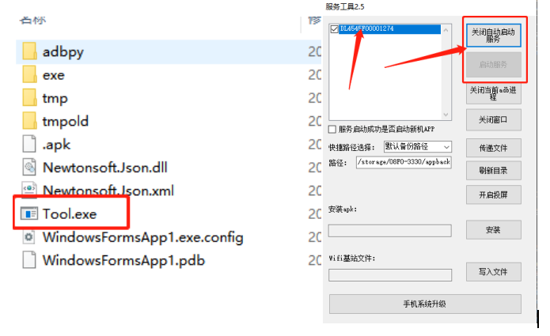

# 常见问题

#### 1. 打开C-C新机APP后，弹出【警告】error|连接节点失败，请重试

需要把手机和电脑连接，并且电脑打开连接工具WindowsFromApp1.exe,然后点击“启动服务”，在操作备份还原新机环境时要保证手机和电脑连接并开启服务吗，否则会弹出这个错误。

<figure><figcaption></figcaption></figure>

#### 2. 点击“获取新机”提示“服务器异常，请检查网络”

检查手机网络是否正常可以联网，如开启了VPN，检查代理IP网络是否正常，建议先关闭VPN,在获取新机。

#### 3. 系统是否支持自动化脚本框架？

&#x20;  系统支持ATX自动化脚本框架。

#### 4. 系统是否支持电脑端群控操作

&#x20;  正在研发中。

#### 5. 手机GPS定位怎么设置

&#x20; 手机默认屏蔽了GPS定位信号，模拟手机在室内的一个环境（室内GPS无信号），手机的定位还是基站和wifi定位。
